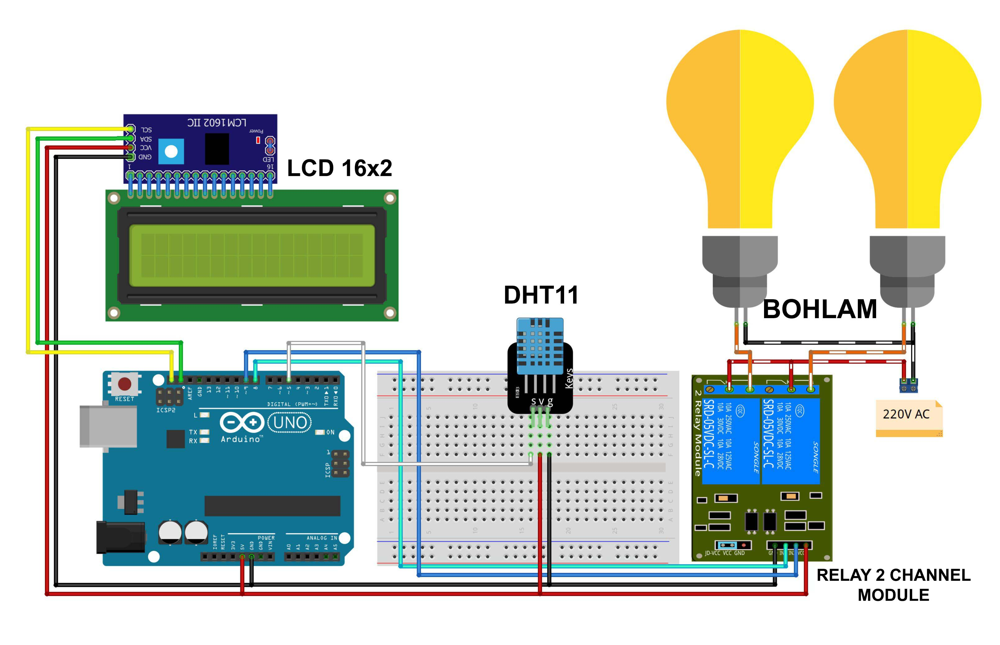

# Chick Room Heating

This project demonstrates an automated heating system for a chick room using an Arduino. The system monitors the temperature using a DHT11 sensor and controls two heating lamps based on the temperature readings. The temperature is displayed on an LCD screen.

## WARNING !!!

- WARNING !!!
- THIS PROJECT IS INVOLVING HIGH VOLTAGE 220V AC... !!!
- MAKE SURE THE CIRCUIT YOU MADE IS CORRECT... !!!

## Components Used

- **Arduino IDE**
- **Arduino Uno** (or compatible board) - 1 Unit
- **DHT11 Temperature and Humidity Sensor** - 1 Unit
- **LiquidCrystal_I2C (LCD)** (16x2) - 1 Unit
- **I2C Module** - 1 Unit
- **Heating Lamps** - 2 Units
- **Project Board / BreadBoard** - 1 Unit
- **Jumper Wires**
- **Power Supply** (for Arduino and other components)

## Schematic

Below you can see a schematic image to facilitate the wiring of cables from the microcontroller to devices, both input and output sensors:

## Circuit Diagram

### Wiring Instructions

- **DHT11 Sensor:**
  - **Data Pin** to Digital Pin 5 (D5) on the Arduino
  - **VCC** to 5V
  - **GND** to GND
- **Heating Lamps:**
  - **Lamp 1** to Digital Pin 8 (D8) on the Arduino --> Connect to IN 1 Relay 1
  - **Lamp 2** to Digital Pin 9 (D9) on the Arduino --> Connect to IN 2 Relay 2
  - **VCC** to 5V (if using a relay module, connect to the relay's VCC and GND)
  - **GND** to GND
- **LiquidCrystal_I2C (16x2) + Include I2C:**
  - **SDA I2C** to pin A4 on SDA pin of the Arduino
  - **SCL I2C** to pin A5 on SCL pin of the Arduino
  - **VCC I2C** to 5V
  - **GND I2C** to GND
- **Pin I2C – Pin LCD**
- **(+) 220V – Com Relay Ch1 dan Ch2**
- **(-) 220V – (-) LED 220V (1) dan (2)**
- **(+) LED 220V (1) – NO Relay Ch1**
- **(+) LED 220V (2) – NO Relay Ch2**

## How It Works

- The DHT11 sensor measures the temperature in the chick room.
- The temperature is displayed on the LCD screen.
- Depending on the temperature:
  - If the temperature exceeds 38°C, both lamps are turned on.
  - If the temperature is between 35°C and 38°C, only Lamp 2 is turned on.
  - If the temperature is below 35°C, both lamps are turned off.

## Code Explanation

- **Sensor Initialization:** The DHT11 sensor is connected to pin D5 and initialized.
- **LCD Initialization:** The LiquidCrystal_I2C library is used to interface with a 16x2 LCD display.
- **Lamp Control:** The code controls the state of two lamps based on temperature thresholds to maintain the desired temperature range.

## Installation

1. Gather all components listed above.
2. Connect the components following the wiring instructions.
3. Open the Arduino IDE and connect your Arduino board.
4. Copy the provided code into the Arduino IDE.
5. Upload the code to your Arduino Uno.

## Usage

- Once installed, the system will continuously monitor the temperature and adjust the heating lamps as needed.
- The current temperature will be displayed on the LCD screen.

## Conclusion

- The Chick Room Heating system provides an automated solution for maintaining optimal temperatures in a chick room. The system ensures that the heating lamps are adjusted based on the temperature, helping to keep the environment suitable for the chicks.
- The DHT11 sensor will detect the temperature around the room, and displays the reading results on the LCD screen. If the room temperature is more than 38*C then the light will turn on turns off, when the temperature is above 35*C then light 1 will turn on lights up and if the temperature is below 35\*C secondly the lights will turn on to warm the room.
